# Users page

Planned features list:

- [x]  IR - <a href="http://www.ibroadlink.com/" target="_blank">Broadlink</a> or  <a href="https://www.logitech.com/en-us/product/harmony-hub" target="_blank">Harmony hub</a> like - records IR commands and send them on request.
- [x]  Control and configure Smart House using nodejs website from mobile.
- [x]  Node Running on Raspberry Pi using serial to send commands to other Arduino using the Bluetooth HC05 (serial to Bluetooth chip).
- [ ]  Auto light using light sensors.
- [ ]  Plants Water system (time and light configuration)
- [x]  Shutters control.
- [x]  Shades control.
- [x]  House Light control
- [ ]  Clap to turn off/on lights.
- [ ]  Security camera and streaming.
- [ ]  Music remote control.
- [ ]  Hot water auto and timer control. (turn boiler for x hours - or everyday from hour to hour)
- [ ]  LCD Screen on main arduino to monitor and status.
- [x]  On wall Touch switch in parallel to digital control.
- [ ]  IR Control for Air Condition - temp sensors. weather forecast and outside temperature and humidity - start Air Condition for x hours and auto close - with temp variation plans.
- [x]  Remote update the other Arduino station from RF24.
- [ ]  Send notifications when dish washer is done (no power consumption)
- [ ]  Central logging station
- [ ]  Easy updates to station (download firmware from github and flash to specific address)
- [ ]  Dynamic remote controls recording and UI setup
- [ ]  Configuration server

# How to install

## Install PI (Model B Revision 2.0)

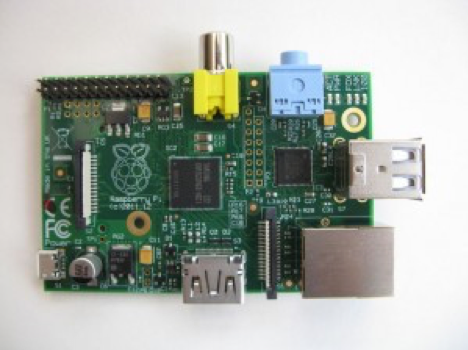

Download and burn image
—————————
Download this image-> https://downloads.raspberrypi.org/raspbian_lite/images/raspbian_lite-2019-06-24/2019-06-20-raspbian-buster-lite.zip

Burn the image with this tool -> https://www.balena.io/etcher/

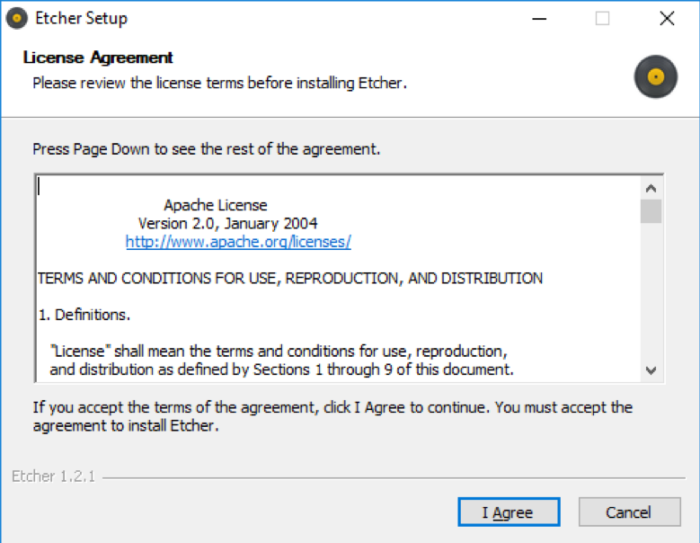
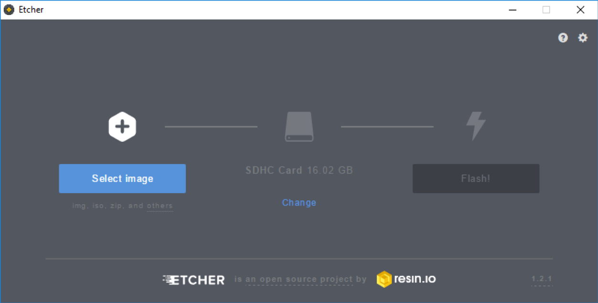

Select the download zip file -> 2019-06-20-raspbian-buster-lite.zip

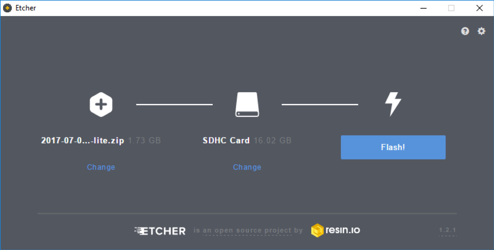
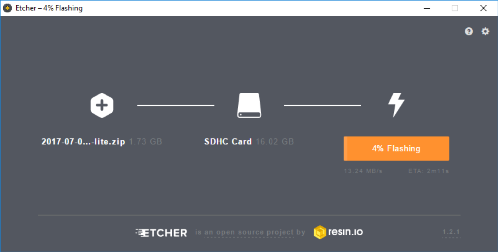
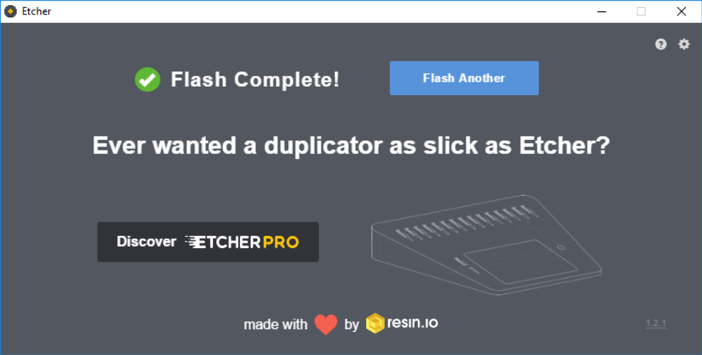


sources:
(https://www.raspberrypi.org/documentation/installation/installing-images/README.md)
(http://www.pogsdotnet.com/2017/12/replicating-nextflix-part-1-installing.html)

Plug the scared back and boot the pi

## Enable ssh

sudo raspi-config (https://www.raspberrypi.org/documentation/remote-access/ssh/)

Change pass
sudo raspi-config (https://www.theurbanpenguin.com/raspberry-pi-changing-the-default-users-password-and-creating-addtional-accounts/)

## Install red node

(https://nodered.org/docs/getting-started/raspberrypi)

bash <(curl -sL https://raw.githubusercontent.com/node-red/raspbian-deb-package/master/resources/update-nodejs-and-nodered)

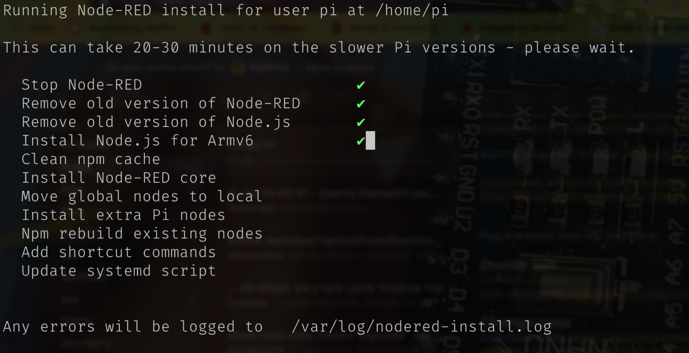

Then make red node run at boot as a service
-> 	sudo systemctl enable nodered.service

Open the ui http://<ip-address>:1880

## Install ui dashboard (red-node module)

cd ~/.node-red 
npm i node-red-dashboard
(http://www.steves-internet-guide.com/node-red-dashboard/)

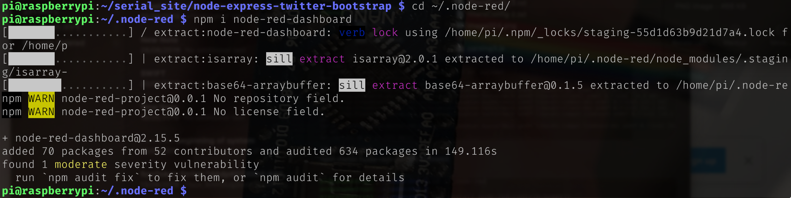


To see the dashboard go to http://127.0.0.1:1880/ui/

## Install applehomekit (red-node module)
https://www.hackster.io/chirila-radu/interfacing-apple-homekit-with-the-node-red-smart-home-a7ae51
sudo apt-get install libavahi-compat-libdnssd-dev

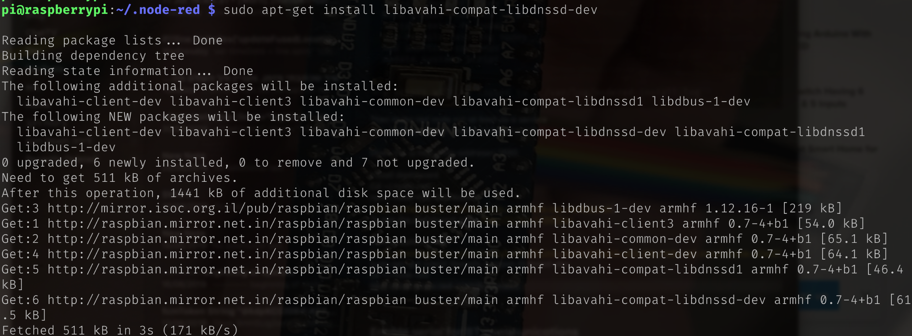

cd ~/.node-red
## npm install node-red-contrib-homekit

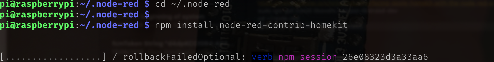

Start node-red
—————————
node-red-start

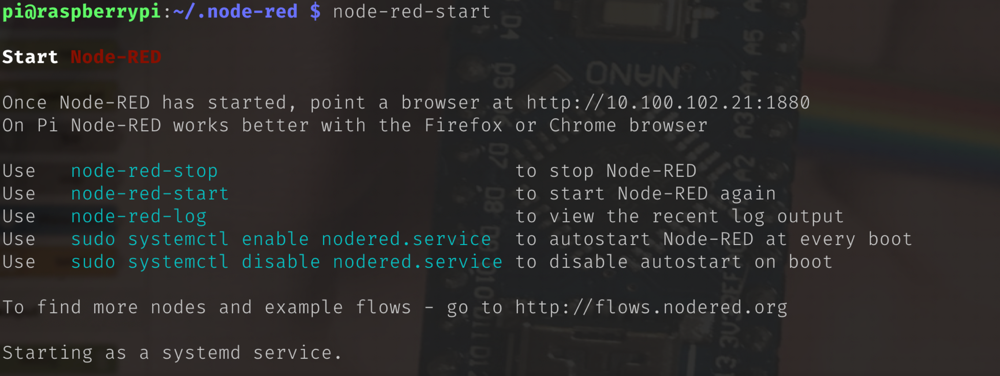

## Enable serial for BT communications
—————————————————————————————
Disable the console so it will not clatter the serial port to our gateway
(https://hallard.me/enable-serial-port-on-raspberry-pi/)

## Install the node js http rest api server
—————————————————————————————
 TBD

## Enable NO-IP
————————————————

mkdir /home/pi/noip
cd /home/pi/noip
wget https://www.noip.com/client/linux/noip-duc-linux.tar.gz
tar vzxf noip-duc-linux.tar.gz
cd noip-2.1.9-1
sudo make
sudo make install

After typing “sudo make install” you will be prompted to login with your No-IP account username and password.

sudo /usr/local/bin/noip2

sudo noip2 ­-S (Capital “S”)

Source:
https://www.noip.com/support/knowledgebase/install-ip-duc-onto-raspberry-pi/

## Utils
————————
Find large files to delete
du -s * | sort -nr | head (https://raspberrypi.stackexchange.com/questions/7500/how-to-get-a-good-overview-over-used-space)
